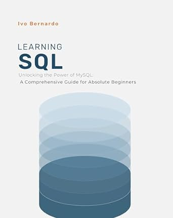

# SQL Fundamentals: A Comprehensive Guide for Beginners 👨‍💻👩‍💻
SQL (Structured Query Language) is a powerful tool used for managing and manipulating relational databases and widely used throughout different companies and different job roles.

This  guide covers all the fundamental concepts and techniques you need to know to become proficient in SQL. From basic querying to advanced filtering, each chapter is designed to provide you with practical knowledge and hands-on experience.

This repository serves as the companion materials for the book [https://www.amazon.com/SQL-Absolute-Beginners-Unlocking-Comprehensive-ebook/dp/B0CYTKXYSB?ref_=ast_author_dp](SQL Fundamentals: A Comprehensive Guide for Beginners) authored by [https://www.linkedin.com/in/ivobernardo/](Ivo Bernardo), available for purchase on Amazon and other major platforms.

# Table of Contents

* Basic Querying: Get started with SQL by learning how to write basic queries to retrieve data from tables.

* Data Types: Understand the different data types supported by SQL and learn how to choose the appropriate data type for your columns.

* Creating and Modifying Tables: Learn how to create tables, define columns, and modify table structures to suit your data requirements.

* Combining Tables: Explore various methods for combining data from multiple tables using joins and unions.

* More on Select Statements: Dive  into the SELECT statement and its advanced features, including aliases, subqueries, and aggregate functions.

* Updating Information: Modify existing data in your tables with INSERT, UPDATE, and DELETE statements.

* Advanced Filtering: Learn advanced filtering techniques, including WHERE clauses, LIKE patterns, and logical operators.

# Running the Examples
To run the examples provided in this repository, you'll need to setup MySQL - I recommend installing the MySQL Server + Workbench bundle. You can install these on your local machine but you can also use online platforms for practice, although you are limited on certain tools that prevent you from creating data.

# Example Execution
- Clone or download this repository to your local machine.
- Navigate to the desired chapter or example script.
- Open MySQL Workbench and connect to the server.
- Copy or write the SQL code from the script file and execute it in your query editor.

# Feedback and Contact
I hope you find this guide valuable in your journey to mastering SQL. If you have any questions, feedback, or suggestions for improvement, feel free to reach out to me at ivopbernardo@gmail.com.

Happy querying!

[SQL for Absolute Beginners Course](https://www.udemy.com/course/sql-for-absolute-beginners/?referralCode=23E560A160F7202E026F): If you're new to SQL or need a refresher, this course in Udemy is your go-to!

[Learn SQL Book - Paperback and Kindle Version](https://www.amazon.com/SQL-Absolute-Beginners-Unlocking-Comprehensive/dp/B0CZ63JGQ4/ref=tmm_pap_swatch_0?_encoding=UTF8&qid=&sr=): Grab the "Learn SQL Book" in Kindle or Paperback Version.

[Learn SQL Book - PDF Version](https://ivopbernardo.gumroad.com/l/sqlabsolutebeginners): Grab an inexpensive PDF version of the book here.

[Learn SQL Book - Udemy Course](https://www.udemy.com/course/sql-for-absolute-beginners/?referralCode=23E560A160F7202E026F): Video lectures available here.